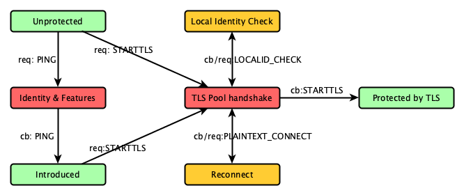

# Message Flow between Application and TLS Pool

> *Especially when using the Asynchronous API, where messages
> are sent directly, it is useful to have an idea of what to
> send and what to expect.*

The most important flow to understand is the `STARTTLS` handling flow.
This goes through a few stages, and can be captured in a simple
state diagram.  The simplified synchronous API captures most of
this in its own logic, but with the Asynchronous API you need to
do it yourself, and so, you need to understand it.

So what does this mean?

  * Arrows are messages; `req:XXX` is short for a request message
    to the TLS Pool, with the command set to `PIOC_XXX_V2` and
    `cb:YYY` is short for a callback in response to a request,
    when the TLS Pool sends an answer or an intermediate query,
    with the command set to `PIOC_YYY_V2`.

  * Look at the colors of the traffic light; red makes you wait
    because the TLS Pool is at work; yellow is for the processing
    of a callback in which the TLS Pool asks for additional info;
    green is when you are free to act.  Of course the colours only
    reflect the handling of one connection; the Asynchronous API
    and the TLS Pool welcome progress on other connections.

  * Not shown are `cb:ERROR` responses.  Simply be prepared to
    receive them at any time.  You can also send an `ERROR` to
    the TLS Pool.  You would do this when you are not willing
    to respond to a callback.  Simply abandoning the callback
    without closing the file descriptor would leave a process
    hanging, which could perhaps cause resource contention.

The transitions are described in detail in `<tlspool/commands.h>`
and will not be repeated here.  The states in the diagram can
be described as follows:

  * **Unprotected** are those connections that have not started
    TLS and exchange information in plain view.

  * **Identity & Features** is a simple negotiation of your
    application's dependency on the TLS Pool.  The interaction
    is optional, and since it always runs in the same manner
    it has no value to do repeatedly.

  * **Introduced** is when your application's idea of the
    time-stamped identity (thus version) and desired optional
    features have been negotiated, and your application knows
    if it can move forward.

  * **TLS Pool handshake** is when the TLS Pool is exchanging
    the messages to secure a connection.  It should not need
    your involvement, since you sent it the socket over which
    it could run the handshake.

  * **Local Identity Check** is a callback from the TLS Pool,
    in which it asks your application, which presumably is a
    server, if it will agree with a proposed identity.  This
    is taken from the Server Name Indication and it is the
    common mechanism by which a multi-named server can show
    whether a host name has been configured for action.

  * **Reconnect** is the point where the former plaintext
    handle, which has become a TLS-protected handle, is
    replaced with a new plaintext handle.  This normally
    is constructed with `socketpair(2)`; one end is the
    new plaintext socket for your application and the
    other end is for the TLS Pool.

  * **Protected by TLS** may feel like your application is
    still doing plaintext operations, but the TLS Pool sits
    between you and the network.  It will silently encrypt
    and decrypt the traffic to and from your peer.

Needless to say that **Unprotected** is the stage before the
`STARTTLS` operation that is built into many protocols.
When a separate port has been allocated for a TLS version
of a protocol, then this stage is departed immediately,
as if `STARTTLS` was agreed on immediately after the
connection.

## Callbacks and State Diagrams combine well

One might consider callbacks as a moment to quickly
make a small decision.  This is indeed how the TLS Pool
works.  A similar thing might be said about DNS lookups
in a resolver like Unbound.

An event loop such as libev, libevent or libuv can be
used to make such callbacks when an event arrives, and
this the `tlspool_async_process()` call was designed
for that kind of behaviour.

A source file handling a state diagram of this kind
may end up being a sequence of callback handlers that
continue until they have initiated other work that
can lead to the following callback.  All that is needed
then, is a data structure to share the state between
these callbacks.

A somewhat extreme example of this idea is our
[KXOVER](https://github.com/arpa2/kxover)
project, which migrated to a TLS-based approach and
for which some of the TLS Pool development is driven
forward!  Specifically look at the files `src/kxover.c`
and `src/tlspool.c` for examples.
